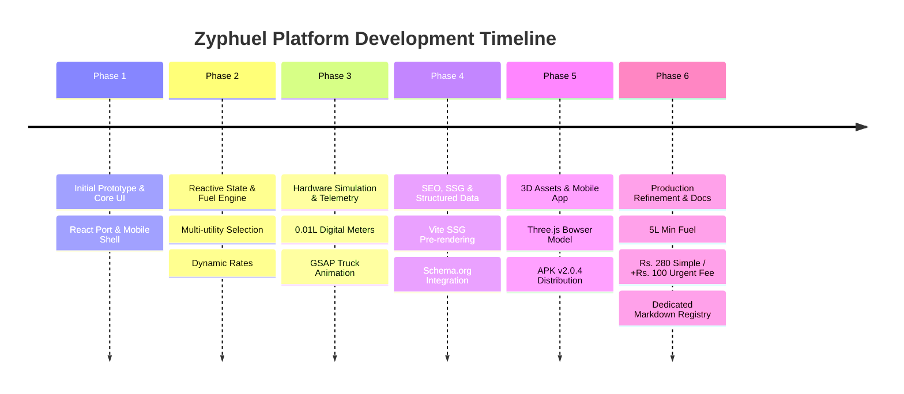

# Zyphuel Web Application — Complete Master Changelog (Old to New)

This document records the complete chronological log of all changes, refactors, feature implementations, and pricing calibrations across the Zyphuel platform from inception to present.

---

## Chronological Overview of All Changes

---

## Phase 1: Prototype Foundation & Core UI

### 1.1 Initial Architecture & Layout
- **Created**: Initial React + Vite application shell with responsive CSS custom properties (`:root` design tokens).
- **Branding**: Implemented petroleum dark blue (`#0284c7`), amber fuel gold (`#f59e0b`), mint green (`#10b981`), and slate gray palette.
- **Components Built**: `Navbar.jsx`, `Footer.jsx`, `ThemeToggle.jsx`, `ToastContext.jsx`.
- **Pages Scaffolding**: Setup routes for `/`, `/order/`, `/about/`, `/services/`, `/download/`, `/contact/`, `/blog/`, `/privacy/`, `/terms/`, and `/404.html`.

---

## Phase 2: Reactive State & Dynamic Fuel Engine

### 2.1 Centralized Fuel Price Management
- **Created**: `src/context/FuelPriceContext.jsx` and `src/data/fuelPrices.js`.
- **Supported Commodities**:
  - Super Euro-V Petrol (`Rs. 345.87 / Litre`)
  - Hi-Cetane Euro-V Diesel (`Rs. 378.05 / Litre`)
  - High-Octane 97 (`Rs. 365.00 / Litre`)
  - LPG Gas Cylinder (`Rs. 258.65 / Kilogram`)
  - Potable Clean Water Tanker (`Rs. 100.00 / Gallon`)
- **Dynamic Rates Sync**: Enabled real-time state consumption across Order page, Services cards, and Live Marquee tickers.

### 2.2 Multi-Category Order Selection
- Implemented category selection allowing consumers to toggle and bundle Petrol, Diesel, High-Octane, LPG Gas, and Potable Water within a single checkout session.

---

## Phase 3: Hardware Simulation, Telemetry & Dispatch

### 3.1 0.01L Calibrated Flow Meter Simulation
- Outfitted UI with positive-displacement flow meter representations, optical encoder telemetry badges, and Automatic Temperature Compensation (ATC at 15°C reference).
- Added `RefuelingLifecycleTracker.jsx` to visually simulate 3D fuel nozzle engagement, high-resolution volume counters, and digital invoice generation.

### 3.2 GSAP Truck Dispatch Animation
- Built custom GSAP button animation where clicking "Complete Order" morphs the button into an animated delivery bowser driving across the screen before launching the order tracker modal.

---

## Phase 4: Production SEO, SSG & Indexing

### 4.1 Static Site Generation (SSG) Pre-rendering
- Built `prerender.js` and `src/entry-server.jsx`.
- Configured Vite build pipeline to pre-render all **16 static HTML routes** (`/`, `/order/`, `/about/`, `/services/`, `/download/`, `/contact/`, `/privacy/`, `/terms/`, `/blog/`, `/404.html`, and 6 blog subpages).
- Auto-generated and synchronized `public/sitemap.xml`, `robots.txt`, `llms.txt`, and Google Search Console verification tags.

### 4.2 Structured Data (Schema.org)
- Integrated `LocalBusiness`, `Organization`, `Service`, `OfferCatalog`, and `SoftwareApplication` JSON-LD schemas on all relevant pages.

---

## Phase 5: 3D Visual Assets, Mobile APK & Brand Authenticity

### 5.1 Three.js Interactive 3D Bowser Showcase
- Created `src/components/Carousel3D.jsx` on the Home page, allowing users to rotate and inspect the digital 3D model of the Zyphuel micro-refueler bowser.

### 5.2 3D Leadership & Equipment Perspective Cards
- Added 6 perspective 3D rotating cards on `AboutPage.jsx` featuring Founder & CEO Muhammad Daniyal, Sales Manager Adil Farooq, the Executive Team, Mobile APK QR Code, Calibrated Tanker, and HAZMAT Uniform.

### 5.3 Official Android APK v2.0.4 Release Portal
- Launched `/download/` with direct download link for `/apk/zyphuel-v2.0.4.apk` (12.4 MB, Android 8.0+), biometric authentication support, 2-hour rate alert daemon, and smartphone QR scanner.

### 5.4 Startup Authenticity & Slogan
- Introduced the brand transparency ethos: *"Not a corporate giant — just an agile, passionate startup delivering doorstep energy with speed and honesty."*

---

## Phase 6: Precision Dispatch, Pricing Calibration & Automated Documentation

### 6.1 Operating Schedule & Office Hours Box
- Added dedicated operational schedule box across `HomePage.jsx`, `ContactPage.jsx`, `PrivacyPolicyPage.jsx`, and `TermsOfUsePage.jsx`:
  - **Monday – Thursday**: 8:00 AM – 8:00 PM
  - **Friday**: 8:00 AM – 1:00 PM
  - **Saturday – Sunday**: 10:00 AM – 6:00 PM
  - **Fuel Delivery (24/7)**: Always Active (round-the-clock dispatch)

### 6.2 Startup Transparency Consolidation
- Cleaned up repetitive transparency boxes across child screens.
- Standardized to a single prominent notice in the `HomePage.jsx` Hero.

### 6.3 Left-to-Right Moving Fuel Price Ticker
- Cloned price ticker items into 4 seamless loops and introduced the `tickerSlideLTR` continuous CSS keyframe animation moving smoothly from left to right with pause-on-hover.

### 6.4 Streamlined Order Form UX
- Removed duplicate breadcrumb navigation (`[Home] / Order Fuel`).
- Removed Quick Lahore Sector Auto-Fill chips, "Powered by Google Maps" caption, and optional address instructions textarea in favor of a clean single address field.

### 6.5 Strict 5 Litres Minimum Fuel Volume
- Replaced 1L minimum limit with strict **5 Litres** floor on fuel orders.
- Updated quantity stepper, manual input validation, and volume chips: `[5L, 10L, 20L, 50L ⚡ Free Delivery, 100L, 250L, 500L, 1000L]`.

### 6.6 Calibrated Delivery Fee Architecture
- **Simple / Standard Delivery (20–45 mins)**:
  - Sub-50L orders: **Rs. 280.00** nominal delivery fee (revised from Rs. 250 due to fuel price increases).
  - 50L+ orders: **Free Delivery (Rs. 0.00)**.
- **Urgent / Priority Delivery (10–20 mins)**:
  - Controlled, reasonable express priority surcharge of **+Rs. 100.00** flat.
  - Sub-50L urgent orders: Rs. 280 + Rs. 100 = **Rs. 380.00**.
  - 50L+ urgent orders: Rs. 0 + Rs. 100 = **Rs. 100.00**.
- Live UI synchronization across schedule cards, summary sidebar, and checkout total.

### 6.7 Automated WhatsApp Order Dispatch
- Integrated instant redirect to official WhatsApp helpline (`+92 3230-112464`) with pre-filled, URL-encoded order details (Customer Name, Phone, Delivery Address, Fuel Grade, Litres, Dispatch Speed, Delivery Fee, Total Cost).

### 6.8 Master Documentation Registry & Agent Rules
- Created `docs/README.md` master index.
- Created 10 primary page documentation files under `docs/pages/` (`home.md`, `order.md`, `about.md`, `services.md`, `download.md`, `contact.md`, `blog.md`, `privacy-policy.md`, `terms-of-use.md`, `not-found.md`).
- Created 6 technical subpage documentation files under `docs/pages/subpages/` (`future-of-fuel-delivery-lahore.md`, `download-zyphuel-apk-guide.md`, `generator-refueling-services-lahore.md`, `generator-diesel-lpg-delivery-lahore.md`, `iot-telemetry-fuel-delivery.md`, `zyphuel-calibrated-telemetry-fleet.md`).
- Updated `AGENTS.md` and `GEMINI.md` with mandatory auto-update protocols for all future changes.

---

## Phase 7: Retail Petrol Pump Rate Calibration, Order Page Polish & Vibe-Coding Context Registry

### 7.1 Retail Petrol Pump Rate Markup (+Rs. 2.50 / Litre)
- **Business Rule Established**: Retail fuel stations in Lahore operate with an inland transport / dealer margin over base OGRA ex-depot notifications.
- **Formula**: `Retail Petrol Pump Rate = Base Price + Rs. 2.50 / Litre`.
- **Applicability**: Applied uniformly to **Petrol**, **Diesel**, and **High-Octane**.
- **Dynamic Invariance**: Whether market rates increase, decrease, or remain constant ("jab bhi price kam ho ya zada ho ya same rahe"), the +Rs. 2.50/L retail pump tariff is consistently calculated.
- **LPG & Water**: Retain verified market rates without pump tariff.
- **Implementation**:
  - `src/data/fuelPrices.js`: Defined `PUMP_RATE_MARKUP = 2.50`, exported `FUEL_BASE_PRICES` and calculated `FUEL_PRICES`.
  - `src/context/FuelPriceContext.jsx`: Dynamically applied `PUMP_RATE_MARKUP` to live scraped Trackmate API rates and exposed `basePrices`, `prices`, and `pumpMarkup`.

### 7.2 Order Page UI & Live Rates Integration
- **Engine Calculation**: The +Rs. 2.50 markup is factored directly into `prices.petrol`, `prices.diesel`, and `prices.highOctane`.
- **Pure & Clean User Interface**: All explicit `Pump Rate (+Rs. 2.50)` formula labels, suffixes, and breakdown texts were purged so users view only the final clean rates.
- **Price Ticker**: Shows clean, live commodities:
  - `Petrol (Premier Euro 5): Rs. {prices.petrol.toFixed(2)}/L`
  - `Diesel (Hi-Cetane Euro 5): Rs. {prices.diesel.toFixed(2)}/L`
  - `High-Octane (Euro 5): Rs. {prices.highOctane.toFixed(2)}/L`
  - `Doorstep Delivery: Rs. 280 • Urgent Express: +Rs. 100`
- **Market Rates Indicator Banner**: Cleanly presents `Live Market Rates Active: Petrol Rs. {rate}/L • Diesel Rs. {rate}/L • High-Octane Rs. {rate}/L`.
- **Mini Fuel Cards & Summary**: Display clean `Rs. {rate}/L` and standard `Unit Rate` without technical markup annotations.
- **Digital Invoice & WhatsApp**: Synchronized with verified prices smoothly.

### 7.3 Consumer Order Flow De-cluttering & UI Deletions
- Removed confusing `Orders of 50 Litres or more receive 100% FREE Delivery` text from consumer order checkout.
- Removed redundant `Notice Before Ordering: Due to nationwide fuel price increases...` banner above Step 1 form items.
- Removed all visible `Pump Rate (+Rs. 2.50)` formula badges across `OrderPage.jsx` and `ServicesPage.jsx`.

### 7.4 Vibe-Coding Context Files Integration
- Integrated all 8 core context markdown files from `D:\Games\vibe-coding-context-files\vibe-coding-context-files` into `docs/vibe-coding/`:
  - `README.md`, `architecture.md`, `phases.md`, `database.md`, `prompts.md`, `security.md`, `error-handling.md`, `generator-prompt.md`.
- Tailored each file to specifically document the Zyphuel web application.

### 7.5 Master Documentation Logs
- Created `remove.md` in repository root logging deprecated features and superseded pricing logic.
- Created `delete.md` in repository root logging purged notices and dead code removals.
- Updated `docs/pages/order.md` and `docs/pages/services.md` with latest parameter calibrations.
- Updated `docs/README.md` master index.

---

## Phase 8: Search Engine Indexing, Internal Linking Overhaul & HTML Sitemap

### 8.1 Resolution of Non-Indexing for Deep Pages & Subpages
- **Problem Diagnosed**: Search engines (Googlebot) had indexed only Home (`/`) and Services (`/services/`), while deep pages (`/about/`, `/order/`, `/download/`, `/contact/`, `/privacy/`, `/terms/`) and all 6 blog fuel guides (`/blog/.../`) remained unindexed or queued.
- **Root Cause**:
  1. Subdomain crawl quota limits on free hosting (`*.netlify.app`).
  2. Weak internal link architecture to subpages (subpages were not linked from site-wide headers or footers, rendering them near-orphan pages).
  3. Lack of an accessible HTML Sitemap directory.
  4. Non-standard `X-Robots-Tag: all` instead of `index, follow`.

### 8.2 Footer Internal Linking Architecture Overhaul
- **File Modified**: `src/components/footerData.js` and `src/components/Footer.jsx`.
- Added dedicated **"Fuel & Energy Guides"** column to the footer with direct internal links to all 6 subpages:
  1. `OGRA Daily Fuel Pricing Reform` (`/blog/future-of-fuel-delivery-lahore/`)
  2. `Zyphuel APK Setup & Install Guide` (`/blog/download-zyphuel-apk-guide/`)
  3. `Industrial Generator Diesel Logistics` (`/blog/generator-refueling-services-lahore/`)
  4. `Commercial Diesel & LPG Safety Standards` (`/blog/generator-diesel-lpg-delivery-lahore/`)
  5. `Calibrated Flow Meters & IoT Telemetry` (`/blog/iot-telemetry-fuel-delivery/`)
  6. `Mobile Refueling Fleet in Lahore` (`/blog/zyphuel-calibrated-telemetry-fleet/`)
- Result: Every single URL across the entire website now provides Googlebot direct, do-follow links to every blog subpage, dramatically multiplying internal PageRank.

### 8.3 Dedicated HTML Sitemap Page (`/sitemap/`)
- **File Created**: `src/pages/HtmlSitemapPage.jsx`.
- Complete 3-category directory indexing all 16 canonical public URLs:
  - Core Navigation & Commercial Services (6 URLs)
  - Fuel & Energy Knowledge Guides / Subpages (7 URLs)
  - Legal, Privacy & Compliance (2 URLs)
  - Links to raw XML sitemap and robots.txt.
- **Routing**: Added `/sitemap` and `/sitemap/` in `src/App.jsx`.
- **SSG Pre-rendering**: Integrated into `prerender.js` to generate static `dist/sitemap/index.html`.
- **XML Sitemap Sync**: Added `/sitemap/` with Priority `0.9` and `daily` change frequency.

### 8.4 Crawler Directives & Header Standardization
- **`public/robots.txt`**: Moved `Sitemap: https://zyphuel.netlify.app/sitemap.xml` to top priority, added explicit `Allow: /sitemap/` and `Allow: /blog/*`, consolidated user-agent rules to eliminate Googlebot block discarding.
- **`netlify.toml`**: Standardized `X-Robots-Tag` from `all, ...` to `index, follow, max-image-preview:large, max-snippet:-1, max-video-preview:-1`. Added 301 redirect for `/sitemap` -> `/sitemap/`.
- **`public/_redirects`**: Added 301 redirect `/sitemap /sitemap/ 301`.
- **Documentation**: Created `docs/pages/sitemap.md` and updated `docs/README.md`.
