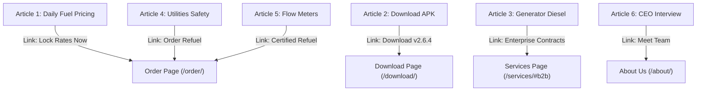

# Zyphuel Master Editorial & Articles Knowledge Index (`articles.md`)

This document catalogs the full editorial repository, SEO keyword mappings, target search intents, internal linking structures, and synchronization logs for all educational articles published on the Zyphuel platform from inception ("start") to the present ("now").

---

## 1. Editorial Master Registry

| ID | Title | Slug | Target Audience | Primary Keyword | Est. Read Time |
|---|---|---|---|---|---|
| 1 | Pakistan’s Shift to Daily Fuel Pricing: OGRA Reform & App Alerts | `future-of-fuel-delivery-lahore` | Daily commuters, fleet managers | `DailyFuelPricing` | 6 min |
| 2 | How to Download and Install Zyphuel APK: Biometrics & Live GPS | `download-zyphuel-apk-guide` | Android smartphone users | `ZyphuelAPK` | 5 min |
| 3 | Powering Through Load-Shedding: Industrial Generator Refueling | `generator-refueling-services-lahore` | Commercial plazas, clinics, factories | `GeneratorDiesel` | 6 min |
| 4 | Generator Diesel & Sealed LPG Refills: Safety Standards | `generator-diesel-lpg-delivery-lahore` | Restaurant owners, residential estates | `LPGGasCylinder` | 5 min |
| 5 | Combating Pump Short-Fueling: Calibrated Meters & Telemetry | `iot-telemetry-fuel-delivery` | Motorists concerned about fuel fraud | `ZeroShortFueling` | 7 min |
| 6 | Mobile Energy Logistics in Lahore: CEO Muhammad Daniyal | `zyphuel-calibrated-telemetry-fleet` | Energy investors, tech sector | `MuhammadDaniyal` | 7 min |

---

## 2. In-Depth Article Syntheses & Content Audits

### Article 1: Pakistan’s Shift to Daily Fuel Pricing
- **Slug**: `future-of-fuel-delivery-lahore`
- **Core Narrative**: Documents Pakistan's downstream petroleum deregulation roadmap from fortnightly pricing to daily rolling Platts averages, leading to full market deregulation by June 2027.
- **Problem Addressed**: High price volatility catching commuters unprepared at retail stations.
- **Solution Presented**: Zyphuel’s 2-hour automated push notification engine alerting users to lock current rates before depot price adjustments occur.
- **Standardized Parameters**: Delivered within 45 minutes, flat Rs. 280 fee, COD for 5L–10L, and instant digital wallets (JazzCash, Easypaisa, NayaPay, Raast).

### Article 2: How to Download & Install Zyphuel APK
- **Slug**: `download-zyphuel-apk-guide`
- **Core Narrative**: Step-by-step setup guide for `Zyphuel.apk` (`v2.6.4.0.0.16`, `31.6 MB`) compiled for Android 7.0+.
- **Features Highlighted**: Biometric authentication (Fingerprint/Face Unlock), GPS sector auto-pinning across Lahore, and Rider Foreground Service streaming live telemetry.
- **Standardized Parameters**: 45-minute delivery SLA, Cash on Delivery (5L–10L), and on-spot digital wallets.

### Article 3: Industrial Generator Refueling
- **Slug**: `generator-refueling-services-lahore`
- **Core Narrative**: Eliminating power blackout downtime for surgical hospitals, IT tech parks, and commercial banks during urban load-shedding cycles.
- **Technical Capabilities**: 50-meter high-reach delivery hoses capable of reaching rooftop generator sets and basement day-tanks without manual jerrycan transport.
- **Compliance Standards**: HAZMAT-trained operators, zero spillage anti-spark nozzles, and density certificates.

### Article 4: Generator Diesel & Sealed LPG Safety Standards
- **Slug**: `generator-diesel-lpg-delivery-lahore`
- **Core Narrative**: Consumer safety guide contrasting calibrated delivery against hazardous loose jerrycan carrying.
- **Technical Capabilities**: Hydrostatic pressure testing of LPG cylinders, on-site digital tare scales, soap-bubble valve testing, and clean Euro-V diesel.
- **Standardized Parameters**: Delivered within 45 minutes, flat Rs. 280 fee, COD (5L–10L), and instant digital wallets.

### Article 5: Combating Pump Short-Fueling
- **Slug**: `iot-telemetry-fuel-delivery`
- **Core Narrative**: Engineering breakdown of mechanical meter wear and intentional nozzle tampering at retail petrol stations (5% to 12% volume loss).
- **Technical Capabilities**: Positive-displacement flow meters with optical pulse encoders accurate to 0.01 Litre, Automatic Temperature Compensation (15°C standard), and Bluetooth live dispensing counters streaming to smartphones.

### Article 6: Mobile Energy Logistics & Founder Interview
- **Slug**: `zyphuel-calibrated-telemetry-fleet`
- **Core Narrative**: Profile of Founder & CEO Muhammad Daniyal, tracing the journey from a software engineering background to building an agile mobile energy logistics network in Lahore.
- **Vision**: Converting physical fuel procurement into an on-demand digital utility, expanding to EV mobile charging, and building sustainable energy telemetry.
- **Standardized Parameters**: Delivered within 45 minutes, flat Rs. 280 fee, COD (5L–10L), and instant digital wallets.

---

## 3. SEO Keyword Matrix & Internal Linking Graph

---

## 4. Synchronization & Audit Log
- **2026-09-25**: Standardized delivery SLA to "Delivered: Within 45 Mins", flat delivery fee to Rs. 280.00, Cash on Delivery to 5L–10L, and added instant digital wallets (JazzCash, Easypaisa, NayaPay, Raast) across all articles in `src/data/articles.js`.
