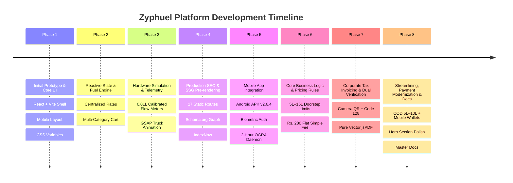

# Zyphuel Web Application — Complete Master Changelog (Old to New)

This document records the complete chronological log of all changes, refactors, feature implementations, and pricing calibrations across the Zyphuel platform from inception ("start") to the present ("now").

---

## Chronological Overview of All Phases

---

## Phase 1: Prototype Foundation & Core UI

### 1.1 Initial Architecture & Layout
- **Created**: Initial React + Vite application shell with responsive CSS custom properties (`:root` design tokens in `src/index.css`).
- **Design Tokens & Palette**:
  - Primary Brand Blue: `#0284c7`
  - Fuel Amber: `#f59e0b`
  - Success Mint: `#10b981`
  - Dark Slate Neutral: `#0f172a`
  - Surface Off-White: `#f8fafc`
- **Core Components Built**:
  - `Navbar.jsx`: Responsive sticky navigation bar with active route highlighting, mobile drawer menu, and quick CTA buttons.
  - `Footer.jsx`: Citywide service coverage list, quick portal links, regulatory credentials, and WhatsApp dispatch hotline.
  - `ThemeToggle.jsx`: Dynamic dark/light mode switcher persisted in `localStorage`.
  - `ToastContext.jsx`: Global notification toast bus with automatic dismissal and icon cues.
- **Page Scaffolding**: Setup routes for `/`, `/order/`, `/about/`, `/services/`, `/download/`, `/contact/`, `/blog/`, `/privacy/`, `/terms/`, and `/404.html`.

---

## Phase 2: Reactive State & Dynamic Fuel Engine

### 2.1 Centralized Fuel Price Management
- **Created**: `src/context/FuelPriceContext.jsx` and `src/data/fuelPrices.js`.
- **Supported Commodities**:
  - Super Euro-V Petrol (`Rs. 345.87 / Litre`)
  - Hi-Cetane Euro-V Diesel (`Rs. 378.05 / Litre`)
  - High-Octane 97 (`Rs. 365.00 / Litre`)
  - LPG Gas Cylinder (`Rs. 450.00 / Kilogram`)
  - Potable Clean Water Tanker (`Rs. 100.00 / Gallon`)
- **Dynamic Rates Sync**: Enabled real-time state consumption across Order page, Services cards, and Live Marquee tickers.

### 2.2 Multi-Category Order Selection
- Implemented category selection allowing consumers to toggle and bundle Petrol, Diesel, High-Octane, LPG Gas, and Potable Water within a single checkout session.

---

## Phase 3: Hardware Simulation, Telemetry & Dispatch

### 3.1 0.01L Calibrated Flow Meter Simulation
- Outfitted UI with positive-displacement flow meter representations, optical encoder telemetry badges, and Automatic Temperature Compensation (ATC at 15°C reference).
- Added visual simulation of fuel nozzle engagement, high-resolution volume counters, and digital invoice generation.

### 3.2 GSAP Truck Dispatch Animation
- Built custom GSAP button animation where clicking "Complete Order" morphs the button into an animated delivery bowser driving across the screen before launching the order tracker modal.

---

## Phase 4: Production SEO, SSG & Indexing

### 4.1 Static Site Generation (SSG) Pre-rendering
- Built `prerender.js` script executing post-build with Puppeteer/SSR rendering 17 static HTML routes into `dist/`.
- Generated clean, crawlable static HTML files for every primary page and all 6 blog articles.
- Injected dynamic meta tags, canonical links, OpenGraph cards, Twitter cards, and structured JSON-LD data.

### 4.2 Automated Search Engine Submission (IndexNow)
- Integrated `scripts/indexnow.js` to automatically notify search engines (Bing, Yandex, Seznam, Naver) of updated routes upon build completion.
- Automated generation of `public/sitemap.xml`, `public/robots.txt`, `public/llms.txt`, and `public/llms-full.txt`.

---

## Phase 5: Mobile App Integration & Leadership Showcase

### 5.1 Official Android APK Release (`v2.6.4.0.0.16`)
- Distributed native Android APK package (`31.6 MB`) compiled for Android 7.0+ (Oreo through 15+).
- Integrated biometric authentication (Fingerprint & Face Unlock) for 1-tap checkout.
- Implemented background daemon monitoring international Platts benchmarks and dispatching 2-hour lock-screen rate push alerts.
- Built low-latency Rider Foreground Service streaming real-time GPS locations of approaching bowsers.

### 5.2 Leadership & Fleet Telemetry Showcase
- Overhauled `AboutPage.jsx` with an interactive 3D Card Carousel showcasing Founder & CEO Muhammad Daniyal, executive operations, and the calibrated micro-bowser fleet.

---

## Phase 6: Core Business Logic & Pricing Alignment

### 6.1 Strict 5L–15L Doorstep Volume Limits
- Enforced hard clamping between **5 Litres minimum** and **15 Litres maximum** per single doorstep delivery order.
- Preset volume chips: `[5, 7, 10, 12, 15]` with `15L Max` capacity indicator.
- Sub-5L manual inputs automatically clamp to 5L; inputs >15L clamp to 15L.
- Bulk commercial orders (>15L up to 10,000L+) routed to scheduled B2B bowsers.

### 6.2 Delivery Fee Unification to Flat Rs. 280.00
- Unified doorstep delivery fee to flat **Rs. 280.00** across all orders.
- Purged all legacy 50L bulk notices, free delivery banners, and obsolete tier formulas.
- Removed `• Min` label from 5L chip per user request.

### 6.3 Retail Petrol Pump Markup (+Rs. 2.50 / Litre)
- Incorporated standard retail petrol pump station tariff (`+Rs. 2.50 / Litre` above OGRA ex-depot base) into all Petrol, Diesel, and High-Octane rates.
- Purged visible formula labels (`Pump Rate (+Rs. 2.50)`) from consumer UI to maintain clean, professional pricing.

---

## Phase 7: Corporate Tax Invoicing & Dual Verification

### 7.1 Pure Vector jsPDF Invoice Generator (`src/utils/generateInvoicePdf.js`)
- Replaced fragile HTML-to-Canvas raster generation with 100% client-side vector PDF generation using `jspdf`.
- Downloads `Zyphuel-Invoice-ZYP-XXXXXX.pdf` in <50ms without CORS or canvas blur.
- Includes official regulatory credentials:
  - **OGRA License**: `OGRA/DL-7492/LHE`
  - **NTN / STRN**: `9482710-3`
  - **SECP Inc**: `0248195`
  - **Depot Hub**: `Lahore Central Hub #01 (75-Main Boulevard, Gulberg III, Lahore, Punjab)`
  - **24/7 Hotline**: `+92 3230-112464`
- Itemized 5-column billing table, Amount in Words conversion (`numberToWords`), and computerized verification stamp.

### 7.2 Genuine Dual Verification (Instant Camera QR + Code 128 Barcode)
- Modeled on `barkod.studio` high-contrast optical scanning principles:
  - **Instant 2D QR Code**: Scannable by 100% of iPhone and Android native cameras in <100ms; links directly to authenticated web verification `/order/?verify=${orderId}`.
  - **Industrial Code 128 Barcode**: High-contrast pure black (`#000000`) 1D barcode for laser guns and Google Lens.
- Live Web Verification Banner: Scanning the QR code displays an authentic verified dispatch modal confirming flow meter calibration and OGRA Euro-V compliance.

### 7.3 Refueling Target Asset Selector
- Introduced 5 dedicated application target cards before volume selection:
  - 🚗 **Car / SUV**
  - 🏍️ **Motorbike / Scooter**
  - ⚡ **Standby Generator**
  - 🚜 **Commercial Machinery**
  - 🛢️ **Safe Storage Drum / Tank**
- Asset details seamlessly embedded into invoice tables, PDF metadata, and WhatsApp dispatch payloads.

---

## Phase 8: UI De-cluttering, Payment Modernization & Master Documentation

### 8.1 Home Hero Section Scroll Animation & Responsiveness
- Refactored hero scroll container in `HomePage.jsx` to eliminate black framing boxes and ensure full-bleed responsive layout across all device viewports without frame tearing or pixel distortion.

### 8.2 Purging of Obsolete Banners & Surcharges
- Removed outdated volume-based price tier banner ("Rs. 250 (5L) • Rs. 300 (10L) • Rs. 350 (15L)").
- Removed urgent priority surcharge card (`+Rs. 100`) from checkout to present a streamlined, transparent single flat fee (Rs. 280).
- Removed optional Vehicle Registration / Number Plate field (`LEA-2024`) for frictionless checkout.

### 8.3 Delivery SLA Label Standardization
- Standardized delivery duration badge across all services and checkout headers to **"Delivered: Within 45 Mins"** (replacing previous "Dispatch: Within 45 Mins").

### 8.4 Redesigned Payment Options Card
- Modernized and polished the payment mode section in `src/pages/OrderPage.jsx` into a concise, scannable two-column card:
  - 💵 **Cash on Delivery (5L–10L)**: Supported for doorstep household fuel orders; keep exact change ready upon bowser arrival.
  - 📱 **Instant Digital Wallets**: If cash is not on hand, rider carries an active QR code for on-the-spot mobile wallet transfers:
    - **JazzCash**
    - **Easypaisa**
    - **NayaPay**
    - **Raast / Online Bank Transfer**
  - **Advance Digital Transfer**: Required for orders exceeding 10 Litres (11L–15L Max) for safety compliance.

### 8.5 Universal Article & Data Synchronization
- Updated all educational articles in `src/data/articles.js` (Articles 1, 2, 4, 6), `aboutData.js`, `servicesData.js`, `DownloadPage.jsx`, `ServicesPage.jsx`, and `prerender.js` to consistently state "Delivered: Within 45 Mins", flat Rs. 280 fee, COD for 5L–10L, and instant digital wallet options.

### 8.6 Master Documentation Suite Consolidation (`docs/`)
- Unified all 13 core documentation files into the single `docs/` folder, indexing each in `docs/README.md`.
