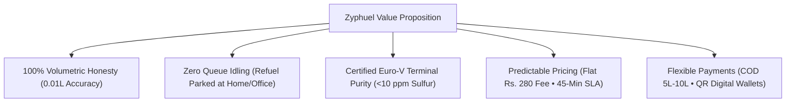

# Zyphuel Product Vision, Origin Story & Strategy (`idea.md`)

This document records the original concept, foundational vision, problem statement, technical solution, and strategic product roadmap of Zyphuel from inception ("start") to the present ("now").

---

## 1. The Origin Story

In a rapidly growing urban metropolis of over 14 million people like Lahore, conventional retail fuel stations suffer from massive operational friction:
- Motorists waste hundreds of thousands of productive hours idling in vehicle queues during peak traffic hours.
- Commuters face chronic anxiety when fuel gauges hit empty on congested arteries like the Lahore Ring Road or Canal Bank Road.
- Residential estates, medical clinics, and commercial IT parks face unexpected power blackouts from unannounced load-shedding, forcing building managers to illegally and dangerously transport diesel in loose plastic containers and rusty drums.

Recognizing these severe urban pain points, tech entrepreneur and software engineer **Muhammad Daniyal** conceptualized and built **Zyphuel**. Leveraging software engineering principles and cloud routing algorithms, Daniyal set out to transform fuel procurement from an inconvenient, manual chore into an agile, on-demand digital utility.

---

## 2. The Core Problems Solved

### 2.1 Retail Pump Congestion & Wasted Time
- **Problem**: Driving to a physical petrol pump station in Lahore, waiting in line, and returning home consumes 30 to 45 minutes per trip.
- **Zyphuel Solution**: Refuel directly where your vehicle is already parked—at home, at work, or roadside—within 45 minutes without leaving your desk or porch.

### 2.2 Short-Fueling & Meter Tampering
- **Problem**: Mechanical meter wear and intentional pump nozzle tampering at retail stations deliver 5% to 12% less fuel than billed.
- **Zyphuel Solution**: Custom-built mobile micro-bowsers fitted with positive-displacement electronic flow meters equipped with optical pulse encoders accurate to **0.01 Litre**, backed by Automatic Temperature Compensation (ATC at 15°C reference) and cryptographically verifiable digital receipts.

### 2.3 Hazardous Manual Jerrycan Transport
- **Problem**: Transporting loose fuel in unapproved plastic bottles or jerrycans violates national fire safety codes (NFPA 30A), risks severe explosions, and contaminates modern common-rail diesel engines with rust and water.
- **Zyphuel Solution**: Certified double-walled safety bowsers operated by HAZMAT-trained personnel using static grounding cables, anti-spark nozzles, and automatic dry-break disconnect couplings.

### 2.4 Load-Shedding & Power Outage Disruptions
- **Problem**: Hospitals, software export centers, financial branches, and residential complexes suffer catastrophic downtime when backup generators run dry during power cuts.
- **Zyphuel Solution**: Scheduled recurring diesel replenishment and emergency on-demand dispatch using 50-meter high-reach delivery hoses capable of reaching rooftop or basement generator tanks.

---

## 3. Core Value Pillars

---

## 4. Product Evolution: From Prototype to Production

### Horizon 1: Prototype & Proof of Concept (Start)
- Simple web ordering form with hardcoded fuel prices.
- Testing customer reception for doorstep petrol top-ups in Gulberg and DHA Lahore.
- Manual phone dispatch confirmation.

### Horizon 2: Telemetry & Calibrated Fleet (Mid-Stage)
- Deployment of double-walled micro-tanker bowsers equipped with digital pulse flow meters.
- Centralized `FuelPriceContext` synchronizing live rates with a +Rs. 2.50 petrol pump retail markup.
- Android APK release (`v2.6.4`) featuring 2-hour market rate alerts.

### Horizon 3: Enterprise Integration & Compliance (Current State)
- Strict 5L–15L consumer doorstep volume calibration with flat Rs. 280 fee.
- Pure vector jsPDF corporate tax invoice engine with genuine Dual Verification (Instant Camera QR + Code 128 barcode).
- Modernized Payment Options: Cash on Delivery for 5L–10L orders plus instant on-spot digital wallets (JazzCash, Easypaisa, NayaPay, Raast / Bank).
- 17-route Static Site Generation (SSG) pipeline for ultra-fast load times and top-tier SEO rankings.

### Horizon 4: Future Horizons (Upcoming Roadmap)
- **Electric Vehicle (EV) Rapid Charging Bowsers**: Mobile high-output DC fast chargers on call for stranded EVs.
- **Smart IoT Tank Telemetry**: Ultrasonic wireless fuel sensors installed in commercial generator day-tanks, triggering automated refill dispatch before fuel levels fall below critical thresholds.
- **Regional Expansion**: Expanding mobile energy logistics from Lahore to Islamabad, Rawalpindi, and Karachi.
