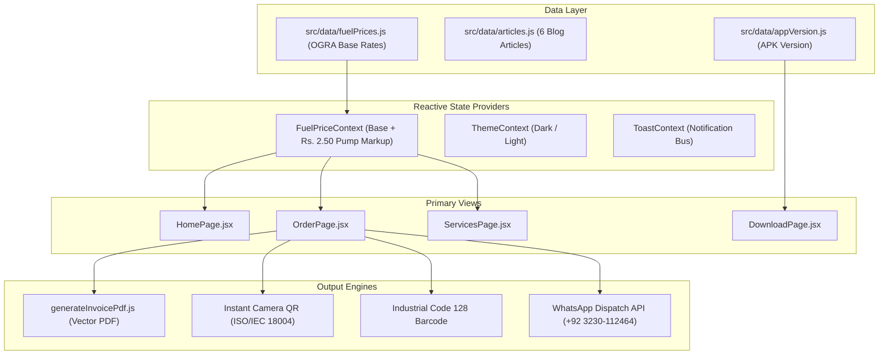

# Zyphuel Codebase Architecture & Directory Structure (`structure.md`)

This document outlines the complete architectural organization, component hierarchy, state flow, and directory structure of the Zyphuel web application.

---

## 1. High-Level Technology Stack

- **Framework**: React 18 (Client SPA + SSR Hydration)
- **Bundler & Dev Server**: Vite 5
- **Routing**: React Router DOM v6
- **Static Site Generation (SSG)**: Custom Node.js pre-renderer (`prerender.js`) via Puppeteer / SSR entry bundle (`src/entry-server.jsx`)
- **PDF Engine**: `jspdf` (100% Client-Side Pure Vector PDF Generation)
- **Typography & Icons**: Inter / Outfit fonts, Font Awesome 6.x Pro
- **Styling Architecture**: Pure CSS custom properties (`:root` design tokens in `src/index.css`) with zero CSS-in-JS runtime overhead
- **Deployment Platform**: Netlify (Automated Git CI/CD, Edge CDN, HTTPS)

---

## 2. Directory Hierarchy

```
zyphuel-react/
├── .agents/                 # AI ecosystem agent configurations & skills
├── .claude/                 # Claude commands & agent prompt specifications
├── docs/                    # Unified documentation hub
│   ├── chat/                # Real-time development chat session archives
│   ├── pages/               # Dedicated documentation for all 11 primary pages
│   │   └── subpages/        # Dedicated documentation for all 6 blog articles
│   ├── vibe-coding/         # Architecture, security & database context guides
│   ├── changes.md           # Master chronological changelog (Start to Now)
│   ├── delete.md            # Purged UI banners, dead code & asset cleanup log
│   ├── remove.md            # Phased-out features, deprecated rules & APIs
│   ├── memory.md            # Immutable business invariants & operational rules
│   ├── structure.md         # Architecture, file tree & component hierarchy
│   ├── idea.md              # Vision, origin story, problem & product roadmap
│   ├── task.md              # Master task execution registry & active backlog
│   ├── pages.md             # Detailed breakdown of all 11 primary pages
│   ├── subpages.md          # Technical specifications for all 6 subpages
│   ├── informtion.md        # Corporate, legal, fleet & technical data
│   ├── articles.md          # Editorial knowledge index & search keyword matrix
│   ├── conclusion.md        # Executive retrospective & platform achievements
│   ├── phases.md            # Phase 1 to Phase 8 milestone deep-dives
│   └── README.md            # Documentation directory navigation index
├── public/                  # Public static assets served at root
│   ├── APK/                 # Official Android APK installation binaries
│   ├── images/              # Hero photos, fleet assets, founder portraits
│   ├── llms.txt             # Markdown summary for LLM scrapers & search bots
│   ├── llms-full.txt        # Full architectural knowledge base for AI agents
│   ├── robots.txt           # Search engine crawler crawl rules
│   └── sitemap.xml          # XML sitemap with 17 static routes
├── scripts/                 # Build-time utilities & scrapers
│   ├── generate_github_graph.js # SVG activity graph generator
│   └── indexnow.js          # IndexNow search engine notification client
├── src/                     # React application source code
│   ├── components/          # Reusable UI components
│   │   ├── Breadcrumbs.jsx  # Schema-compliant visual breadcrumbs
│   │   ├── Footer.jsx       # Global footer with hours, links & disclaimer
│   │   ├── Navbar.jsx       # Responsive navigation header & drawer
│   │   ├── ServiceCard.jsx  # Service offering display card
│   │   ├── ServicesGraphic.jsx # Isometric 3D SVG service illustration
│   │   └── ThemeToggle.jsx  # Dark/Light theme mode switch
│   ├── context/             # Global React state providers
│   │   ├── FuelPriceContext.jsx # Live scraping and cached fuel rate provider
│   │   ├── ThemeContext.jsx # Dark/Light theme persistence
│   │   └── ToastContext.jsx # Toast notification alert system
│   ├── data/                # Static & dynamic data constants
│   │   ├── aboutData.js     # Company milestones, team & article highlights
│   │   ├── appVersion.js    # Centralized APK version constants
│   │   ├── articles.js      # 6 educational blog articles content array
│   │   ├── changelogData.js # Version release history metadata
│   │   ├── fuelPrices.js    # Base OGRA rates & markup definitions
│   │   ├── lahoreSectors.js # Lahore sector coordinates & pin presets
│   │   └── servicesData.js  # B2C & B2B service catalogs, pipeline & FAQs
│   ├── hooks/               # Custom React hooks
│   │   ├── useScrollReveal.js # IntersectionObserver fade-in animations
│   │   └── useSEO.js        # Dynamic document title, meta & canonical updater
│   ├── pages/               # 11 Primary route view components
│   │   ├── AboutPage.jsx    # Company history, leadership & 3D carousel
│   │   ├── BlogListPage.jsx # Article catalog with category filters
│   │   ├── BlogPostPage.jsx # Dynamic article detail reader
│   │   ├── ContactPage.jsx  # Hotline, contact form & Google Map
│   │   ├── DownloadPage.jsx # Android APK download & setup guide
│   │   ├── HomePage.jsx     # Hero video scroll, live ticker, quick order
│   │   ├── HtmlSitemapPage.jsx # Comprehensive HTML sitemap
│   │   ├── NotFoundPage.jsx # 404 error recovery view
│   │   ├── OrderPage.jsx    # 5-step order form, invoice modal & tracker
│   │   ├── PrivacyPolicyPage.jsx # GDPR & local privacy terms
│   │   ├── ServicesPage.jsx # Complete B2C/B2B service catalog
│   │   └── TermsOfUsePage.jsx # Service conditions & COD terms
│   ├── utils/               # Pure utility functions
│   │   ├── generateInvoicePdf.js # Pure vector jsPDF invoice builder
│   │   └── numberToWords.js # Currency amount to formal English words
│   ├── App.jsx              # Main router & layout shell
│   ├── entry-client.jsx     # Client-side React hydration entry
│   ├── entry-server.jsx     # Server-side HTML render entry for SSG
│   └── index.css            # Global CSS styles & design tokens
├── index.html               # Main HTML template
├── prerender.js             # Static Site Generation (SSG) pre-renderer
└── vite.config.js           # Vite build configuration
```

---

## 3. Data & State Flow Architecture



---

## 4. Build & Pre-Rendering Pipeline

1. **`npm run prebuild`**:
   - Executes `scripts/generate_github_graph.js` to render the SVG activity chart and contribution matrix.
2. **`vite build`**:
   - Bundles the client SPA code into `dist/` with code-splitting, asset hashing, and gzip compression.
3. **`vite build --ssr`**:
   - Bundles the SSR entry point `src/entry-server.jsx` into `dist-ssr/entry-server.js`.
4. **`node prerender.js`**:
   - Iterates through all 17 public routes.
   - Pre-renders static HTML with complete JSON-LD schemas and SEO meta tags.
   - Cleans up temporary `dist-ssr/` artifacts.
5. **`node scripts/indexnow.js`**:
   - Automatically submits updated URLs to search engines via the IndexNow protocol.
