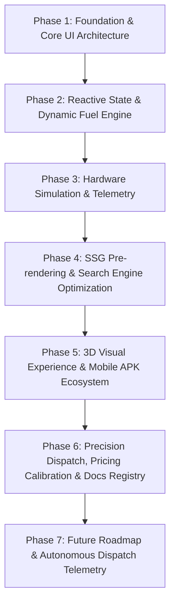

# Zyphuel Web Application — Project Development Phases

This document details the distinct development phases through which the Zyphuel platform was conceptualized, architected, engineered, and optimized for production deployment in Lahore, Pakistan.

---

## High-Level Phase Map

---

## Phase 1: Foundation & Core UI Architecture
- **Objective**: Establish a modern, high-performance React application scaffold capable of lightning-fast page transitions and mobile responsiveness.
- **Key Deliverables**:
  - Set up Vite + React 18 frontend runtime with Single Page Application (SPA) client-side routing (`react-router-dom`).
  - Created modular design system using vanilla CSS custom properties (`var(--brand-primary)`, `var(--brand-gold)`, `var(--brand-mint)`, `var(--bg-primary)`, etc.).
  - Implemented core application layout with dynamic header navigation, sticky brand navbar, dark/light theme switcher, responsive hamburger drawer, and multi-column footer.
  - Scaffolded foundational views: Home (`/`), Order (`/order/`), About (`/about/`), Services (`/services/`), Download (`/download/`), Contact (`/contact/`), Blog (`/blog/`), Privacy (`/privacy/`), Terms (`/terms/`), and Not Found (`/404.html`).

---

## Phase 2: Reactive State & Dynamic Fuel Engine
- **Objective**: Provide instantaneous, synchronized fuel pricing across the entire application without external server latency.
- **Key Deliverables**:
  - Developed `FuelPriceContext.jsx` leveraging React Context and `localStorage` persistence.
  - Modelled official Pakistan Oil & Gas Regulatory Authority (OGRA) fuel rates:
    - Super Euro-V Petrol (Rs. 345.87/L)
    - Hi-Cetane Euro-V Diesel (Rs. 378.05/L)
    - High-Octane 97 (Rs. 365.00/L)
    - LPG Cylinder Gas (Rs. 258.65/kg)
    - Bulk Potable Water (Rs. 100.00/gal)
  - Engineered dynamic live calculation engine in `OrderPage.jsx` supporting multi-category selection, volume sliders, numeric steppers, and real-time subtotal rollups.

---

## Phase 3: Hardware Simulation & Telemetry
- **Objective**: Bridge the trust deficit in retail fuel delivery by demonstrating positive-displacement flow meters and interactive bowser dispatch.
- **Key Deliverables**:
  - Integrated `RefuelingLifecycleTracker.jsx` simulating 0.01L digital optical encoders and Automatic Temperature Compensation (ATC at 15°C reference).
  - Engineered GreenSock Animation Platform (GSAP) truck dispatch button: clicking "Complete Order" morphs the interactive button into a driving bowser truck across a timeline before unveiling the modal tracker.
  - Implemented 3-stage visual progress timeline: *Order Confirmed* → *Fuel Dispatched* → *Delivered & Calibrated*.

---

## Phase 4: SSG Pre-rendering & Search Engine Optimization
- **Objective**: Achieve near-instant first contentful paint (FCP), 100% SEO indexability, and social sharing metadata across all routes.
- **Key Deliverables**:
  - Configured custom SSR entry point (`src/entry-server.jsx`) and Node.js prerender pipeline (`prerender.js`).
  - Static Site Generation (SSG) compiles all 16 distinct URLs into standalone static `index.html` files with injected meta tags, OpenGraph previews, and Twitter cards.
  - Structured data injection via `useSEO.js`: `LocalBusiness`, `Organization`, `OfferCatalog`, and `SoftwareApplication` JSON-LD schemas.
  - Automated build-time generators for `public/sitemap.xml`, `robots.txt`, and `llms.txt`.

---

## Phase 5: 3D Visual Experience & Mobile APK Ecosystem
- **Objective**: Deliver a premium technological aesthetic and distribute the official native Android application.
- **Key Deliverables**:
  - Created `Carousel3D.jsx` using Three.js to render an interactive 3D model of the Zyphuel refueler bowser with orbit control and ambient lighting.
  - Built 6 interactive 3D perspective cards on `AboutPage.jsx` highlighting leadership (Muhammad Daniyal, Adil Farooq), safety gear, and calibrated equipment.
  - Launched official Android APK release portal (`/download/`) for `v2.0.4` (12.4 MB, Android 8.0+), incorporating biometric authentication, 2-hour rate alert daemon, and smartphone QR scanner.
  - Embedded startup authenticity messaging: *"Not a corporate giant — just an agile, passionate startup delivering doorstep energy with speed and honesty."*

---

## Phase 6: Precision Dispatch, Pricing Calibration & Automated Docs
- **Objective**: Optimize the checkout flow, establish clear delivery economics, and build an automated markdown documentation registry.
- **Key Deliverables**:
  - **Operating Hours Card**: Added dedicated operational schedule box across Home, Contact, and Legal pages:
    - Monday – Thursday: 8:00 AM – 8:00 PM
    - Friday: 8:00 AM – 1:00 PM
    - Saturday – Sunday: 10:00 AM – 6:00 PM
    - Delivery (24/7): Always Active
  - **Left-to-Right Price Ticker**: Deployed continuous infinite marquee (`tickerSlideLTR`) moving smoothly across 4 cloned tracks.
  - **Order Form Streamlining**:
    - Enforced strict **5 Litres** minimum fuel threshold (stepper + quick chips `[5, 10, 20, 50, 100, 250, 500, 1000]`).
    - Removed redundant breadcrumbs, quick sector chips, and optional address notes to eliminate checkout friction.
  - **Calibrated Delivery Economics**:
    - Simple Delivery: **Rs. 280.00** (<50L, updated from Rs. 250 due to fuel price increases); **Free** (≥50L).
    - Urgent Delivery: Controlled **+Rs. 100.00** priority surcharge (Sub-50L = Rs. 380; 50L+ = Rs. 100).
  - **WhatsApp Direct Dispatch**: Instant order routing to `+92 3230-112464` with structured, URL-encoded payload.
  - **Automated Documentation Registry**:
    - Created `docs/README.md` master directory.
    - Created 10 primary page documentation files in `docs/pages/`.
    - Created 6 technical subpage documentation files in `docs/pages/subpages/`.
    - Updated `AGENTS.md` and `GEMINI.md` to enforce mandatory automated updates for all AI agents and developers.

---

## Phase 7: Future Roadmap & Autonomous Dispatch Telemetry
- **Planned Enhancements**:
  - Direct OBD-II vehicle telemetry bridge for automatic low-fuel alerts.
  - Automated recurring B2B generator refueling subscriptions with calendar sync.
  - Driver Rider App real-time WebSockets tracking integrating Lahore OpenStreetMap overlays.
  - Multi-city expansion roadmap (Islamabad/Rawalpindi & Karachi terminals).
